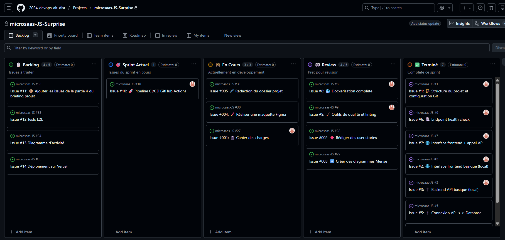
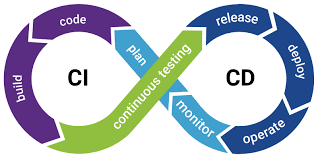

# 🎁 Surprise

### L'application "anti-fuite" pour vos événements festifs

**Juliette SUC**

<div style="font-size: 0.6em; line-height: 1.2; margin-top: 20px;">
  <i>Soutenance du Titre Professionnel CDA</i><br>
  <i>Alternante chez CGI</i>
</div>

---

# Sommaire

1. L'entreprise et mon rôle
2. Genèse et Besoins du projet _Surprise_
3. Gestion de projet et Environnement
4. Démonstration des Interfaces (UI)
5. Plongée dans le Code
6. Sécurité de l'application
7. Tests et Jeux d'essai
8. Veille Sécurité
9. Bilan et Conclusion

---

# 1. L'Entreprise et le Service

---

## CGI


- Entreprise canadienne de services-conseils en TI.
- Intégration de systèmes et solutions d'envergure.
- Mon équipe : **Stinger**.

---

## Mon rôle chez Stinger

- **Cœur de métier :** Solutions web de visualisation et gestion de données cartographiques (SIG).
- **Mon poste :** Développeuse Front-end en alternance.
- **Missions :** Développement de widgets adaptés à Mapstore et Geoserver.

---

## Ma stack quotidienne

- **Frontend :** React, Rx.js, Redux, Mapstore.
- **Outils :** GitLab (CI/CD, Merge Requests), Jira.
- **Infra :** Rédaction de PTI, montées de version sur serveurs Linux.

---

# 2. Le Projet _Surprise_ : Besoins et Contraintes

---

## Le Contexte

- **Le problème :** L'organisation fastidieuse des cadeaux de Noël en famille étendue.
- **Le risque :** Les doublons et les fuites d'informations.
- **Le constat :** Les applications de listes de cadeaux existantes ne répondent pas à tous mes cas d'usage.

---

## Expression des besoins (1/2)

**Besoins fonctionnels :**

- Création d'événements spécifiques avec des listes dépendantes.
- Messagerie et notifications "anti-fuite".
- Fonctionnalité de "cadeau collaboratif" (cagnotte/participation).

---

## Expression des besoins (2/2)

**Besoins non-fonctionnels :**

- Design épuré et accueillant.
- Accessibilité (contrastes, navigation clavier, normes Opquast).
- Respect strict du RGPD et de la confidentialité des données.

---

## Les Personas


- **Alice (35 ans) :** Veut éviter les doublons à Noël.
- **Bastien (28 ans) :** Cherche à participer à un gros cadeau commun.
- **Corentin (26 ans) :** Organise un événement et invite des inconnus.
- **Danaé (22 ans) :** Crée sa liste mais _veut garder la surprise_.

---

## Les Contraintes du projet

- **Temporelles :** ~7 semaines (sur temps de formation Simplon + 5 jours CGI).
- **Budgétaires :** Déploiement et hébergement à 0€.
- **Techniques :** Utilisation obligatoire de Docker imposée par le référentiel.
- **Compétences :** Apprentissage de Node.js et Drizzle ORM _from scratch_.

---

## Livrables attendus

- Un MVP (Minimum Viable Product) fonctionnel.
- Une architecture conteneurisée (Docker).
- Un code versionné, testé et déployé via une chaîne CI/CD.
- Le dossier de conception (MCD, MLD, MPD, User Stories).

---

# 3. Gestion de projet

---

## Méthodologie Agile

- **Rythme :** Sprints courts d'une semaine.
- **Rituel :** Point d'avancement et Sprint Planning chaque lundi matin.
- **Outil :** GitHub Projects (Kanban).

---

## 

---

## Rédaction des User Stories

- Découpage rigoureux des tâches.
- Création d'_Issues_ avec critères d'acceptation stricts.
- **Exemple :** "En tant qu'invité, je souhaite indiquer que j'offre un cadeau pour éviter les doublons".

---

## Environnement Technique

_La Stack sélectionnée_

- **Front-end :** React 19, Next.js, Tailwind CSS v4, Playwright.
- **Back-end :** Node.js, Express, TypeScript, Drizzle ORM, Jest.
- **Base de données :** PostgreSQL (v18).
- **Infra :** Docker, Vercel (Front), Render (Back).

---

## Gestion du Code Source

- Utilisation de **GitFlow** (`main`, `develop`, `feature/...`).
- Validation par _Pull Requests_.
- Convention stricte : _Conventional Commits_.

---

## Objectifs de Qualité & CI/CD



- **En local :** Git Hooks via _Lefthook_ (ESLint, Prettier).
- **Sur GitHub :** Workflows _GitHub Actions_.
- Automatisation des tests unitaires (Jest) et E2E (Playwright) avant chaque merge.

---

# 4. Interfaces Utilisateur (UI)

---

## L'Interface de Connexion / Inscription


---

## Le Tableau de bord d'un Événement


---

## Réserver un cadeau

_Vue d'un invité vs Vue du bénéficiaire_


---

# 5. Extraits de Code Significatifs

---

## Code : Interface Utilisateur (Front-end)

_Composant React 19 avec Tailwind v4_

```tsx
// to de done
```

---

## Code : Interface Utilisateur (Front-end)

_Composant de la liste des cadeaux_

```tsx
// TODO: Insérer le code React du composant d'affichage des cadeaux
// - Utilisation de Tailwind v4 pour le style
// - Mapping des données issues de l'API
// - Rendu conditionnel selon le statut 'isOffered'
```

---

## Code : Composant Métier (Service)

_La logique de réservation d'un cadeau_

```typescript
// TODO: Insérer le code TypeScript du service de réservation (backend)
// - Vérification que l'utilisateur n'est pas le bénéficiaire
// - Mise à jour en base de données avec Drizzle ORM
// - Retour de l'objet mis à jour
```

---

## Code : Contrôleur (API)

_Exposition de la route de réservation_

```typescript
// TODO: Insérer le code Express du contrôleur
// - Récupération de l'ID du cadeau dans l'URL
// - Récupération de l'ID utilisateur via le JWT
// - Gestion des erreurs (403 si non autorisé)
```

---

# 6. Sécurité de l'application

---

## La Protection des Données

- Mots de passe hachés avec **Argon2** ou **Bcrypt**.
- Aucun stockage en clair en base de données.
- Utilisation de variables d'environnement (`.env`) protégées.

---

## Authentification Robuste

- Utilisation de **JSON Web Tokens (JWT)**.
- Signature sécurisée des tokens.
- Middleware de vérification sur chaque route sensible.

---

## Sécurité Applicative : La règle du "Secret"

C'est le cœur métier de mon application.

---

## Filtrage au niveau de l'API

L'API vérifie systématiquement l'identité du demandeur.

---

## Confidentialité absolue

Si l'utilisateur est le bénéficiaire :
**L'API ne renvoie pas le statut de réservation.**

---

## Sécurité des Interfaces

- **XSS :** React échappe automatiquement le contenu.
- **CORS :** Seul mon domaine Front-end peut interroger l'API.
- **CSRF :** Utilisation de cookies `HttpOnly` et `SameSite`.

---

# 7. Tests et Jeux d'essai

---

## Ma Stratégie de Test

- **Unitaires :** Logic métier (Jest).
- **E2E :** Parcours utilisateurs (Playwright).
- **Intégration :** API via Supertest.

---

## Fonctionnalité testée

**La réservation d'un cadeau par un invité.**

---

## Jeu d'essai : Données en entrée

- **Cadeau ciblé :** `Livre de cuisine`
- **Statut initial :** `isOffered = false`
- **Utilisateur :** `Alice (Invitée)`

---

## Jeu d'essai : Résultat attendu

- Code de retour : **200 OK**.
- Statut en BDD : **true**.
- L'interface affiche : "Offert par Alice".

---

## Jeu d'essai : Résultat obtenu

- Code de retour : **200 OK**.
- Statut en BDD : **true**.
- **Écart : Aucun.** ✅

---

## Test de Sécurité (Négatif)

Que se passe-t-il si le bénéficiaire essaie de réserver son propre cadeau ?

---

## Analyse de l'écart

- **Attendu :** Erreur 403 (Interdit).
- **Obtenu :** Erreur 403.
- **Analyse :** La faille logique est correctement bloquée.

---

# 8. Veille Sécurité

---

## Ma Méthodologie de Veille

- Flux RSS sur l'**OWASP**.
- Bulletins de sécurité **Node.js** et **React**.
- Audit automatique via `npm audit` et Snyk.

---

## Vulnérabilité n°1 : Injections SQL

---

## Risque identifié

Concaténer des chaînes de caractères dans les requêtes SQL.

---

## Correction apportée

J'ai choisi **Drizzle ORM** qui utilise par défaut des requêtes paramétrées.
**Le risque est neutralisé par conception.**

---

## Vulnérabilité n°2 : Stockage du JWT

---

## Risque identifié

Le `localStorage` est accessible via des scripts malveillants (XSS).

---

## Correction apportée

J'ai implémenté le stockage du token dans des **Cookies HttpOnly**.
Le JavaScript ne peut plus y accéder.

---

# 9. Bilan et Conclusion

---

## Difficultés rencontrées

- **Le Temps :** Cycle de développement très court (7 semaines).
- **L'Inconnu :** Apprentissage de Node.js et Drizzle en autonomie.

---

## Mes Satisfactions

- Maîtrise d'une stack Full-stack moderne de bout en bout.
- Mise en place d'une CI/CD efficace et automatisée.

---

## Évolutions possibles (1/2)

**La Cagnotte intégrée.**
Permettre le paiement direct via Stripe pour les cadeaux communs.

---

## Évolutions possibles (2/2)

**PWA (Progressive Web App).**
Rendre l'application installable sur smartphone pour l'utiliser en magasin.

---

## Synthèse Professionnelle

Ce projet valide ma capacité à concevoir une architecture sécurisée et scalable.

---

## Perspectives

Signature prochaine de mon **CDI** au sein de l'équipe **Stinger (CGI)**.

---

# Merci de votre attention

Avez-vous des questions ?

---


